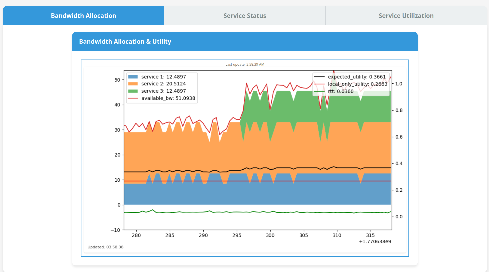

# TURBO: Utility-Aware Bandwidth Allocation for Cloud-Augmented Autonomous Control
Peter Schafhalter∗, Alexander Krentsel∗, Hongbo Wei, Joseph E. Gonzalez, Sylvia Ratnasamy (UC Berkeley), Scott Shenker (UC Berkeley and ICSI), Ion Stoica (UC Berkeley).

This repository is the official codebase for the following [NINeS 2026](https://nines-conference.org) conference paper:

[**TURBO: Utility-Aware Bandwidth Allocation for Cloud-Augmented Autonomous Control.**](https://nines-conference.org/papers/p018-Schafhalter.pdf)
Peter Schafhalter∗, Alexander Krentsel∗, Hongbo Wei, Joseph E. Gonzalez, Sylvia Ratnasamy (UC Berkeley), Scott Shenker (UC Berkeley and ICSI), Ion Stoica (UC Berkeley).

For a talk given on this research project, see this [video presentation](https://www.youtube.com/watch?v=s0t4W24dEN8).


This repository contains a research prototype system that optimizes object detection accuracy for autonomous vehicles by dynamically allocating bandwidth and selecting model configurations across multiple perception services based on real-time network conditions.


Developed by students at [UC Berkeley NetSys Lab](https://netsys.cs.berkeley.edu/).

## Overview



An autonomous vehicle running multiple camera-based perception services faces a fundamental challenge: **how to maximize detection accuracy when offloading inference to the cloud over a bandwidth-constrained network**?

This system solves that problem through:

- **High-performance QUIC transport**: s2n-quic with BBR congestion control enables efficient, multiplexed data transfer between AV and cloud
- **Utility-based bandwidth allocation**: Linear programming solver runs every 500ms to optimally allocate bandwidth across services, maximizing total detection accuracy
- **Adaptive model selection**: Dynamically switches between EfficientDet variants (D1-D7x) and compression strategies based on real-time network conditions
- **SLO-aware processing**: LIFO queue management and timeout enforcement ensure only fresh, timely detection results are used for driving decisions

**Key Features:**

✅ **Multi-camera support** — Simultaneous perception from multiple USB cameras (FRONT, FRONT_LEFT, FRONT_RIGHT)

✅ **LP-based bandwidth allocation** — Utility optimization solver runs every 500ms to maximize detection accuracy

✅ **High-performance QUIC transport** — s2n-quic (Rust) with BBR congestion control for efficient network utilization

✅ **LIFO queue management** — Prioritizes fresh frames, dropping stale data to meet latency SLOs

✅ **Zero-copy IPC** — Shared memory + ZeroMQ for efficient data transfer between components

✅ **Adaptive model selection** — Dynamically switches between 5 EfficientDet variants (D1-D7x) and compression strategies

✅ **Real-time monitoring** — Web dashboard with bandwidth allocation, service status, and network utilization plots

✅ **Comprehensive logging** — Structured Parquet output for experiment analysis and reproducibility

## System Architecture

TURBO is a distributed system with two main components:

### Client Side (Autonomous Vehicle)

Running on the AV's onboard computer (e.g., NVIDIA Jetson):

- **Camera Streams** — Capture frames from multiple USB cameras (FRONT, FRONT_LEFT, FRONT_RIGHT)
- **Client Processes** — One per camera, handles image preprocessing and compression based on allocated model configuration
- **Bandwidth Allocator** — Runs a linear programming solver every 500ms to determine optimal bandwidth allocation and model selection for each service
- **QUIC Client** — High-performance Rust binary that manages per-service bidirectional streams, enforces bandwidth limits, and implements LIFO queue management
- **Ping Handler** — Measures network RTT to the cloud server using ICMP pings

### Server Side (Cloud)

Running on a GPU-equipped cloud instance (e.g., H100):

- **QUIC Server** — Rust binary that receives image data over multiplexed QUIC streams
- **Model Servers** — One per service, runs EfficientDet inference on GPU and returns detection results

### How They Work Together

```
┌─────────────── AV (Client) ───────────────┐       ┌────── Cloud (Server) ──────┐
│                                            │       │                            │
│  Camera → Client → QUIC Client             │       │  QUIC Server → ModelServer │
│  Camera → Client → QUIC Client             │──QUIC─│  QUIC Server → ModelServer │
│  Camera → Client → QUIC Client             │       │  QUIC Server → ModelServer │
│              ↑                             │       │                            │
│         Bandwidth Allocator                │       └────────────────────────────┘
│         (LP Solver + RTT)                  │
│                                            │
└────────────────────────────────────────────┘
```

**Key workflow:**
1. Cameras continuously capture frames and place them in shared memory
2. Each Client reads frames, applies preprocessing/compression according to its assigned model configuration, and sends to QUIC Client
3. QUIC Client manages per-service streams with bandwidth enforcement and LIFO queuing, transmitting over QUIC to the cloud
4. QUIC Server receives images and forwards to ModelServers for GPU inference
5. ModelServers return detection results (bounding boxes, scores) back through QUIC
6. Bandwidth Allocator monitors network conditions (bandwidth from QUIC, RTT from pings) and runs LP solver to update model configurations

For detailed architecture, see [docs/ARCHITECTURE.md](docs/ARCHITECTURE.md).

## Quick Start (Docker) — Recommended

The recommended way to run TURBO is with Docker. The Docker setup automatically orchestrates all processes — 2 on the server (QUIC server + model servers) and 3 on the client (client orchestrator + web dashboard + QUIC client) — handling startup ordering, ZMQ socket management, and inter-process communication for you.

### Prerequisites

- [Docker Engine](https://docs.docker.com/engine/install/) 24.0+ with [Docker Compose V2](https://docs.docker.com/compose/install/)
- [NVIDIA Container Toolkit](https://docs.nvidia.com/datacenter/cloud-native/container-toolkit/latest/install-guide.html) (for GPU inference)
- Linux (tested on Ubuntu 20.04+)

Verify your setup:
```bash
docker compose version   # should be v2.20+
nvidia-smi               # should show your GPU(s)
docker run --rm --gpus all nvidia/cuda:12.0.0-base-ubuntu22.04 nvidia-smi  # GPU in Docker
```

### Setup

1. **Clone the repository:**
   ```bash
   git clone https://github.com/NetSys/turbo.git
   cd turbo
   ```

2. <a id="model-setup"></a>**Download fine-tuned EfficientDet model checkpoints (server only):**

   The system uses custom EfficientDet models (D1, D2, D4, D6, D7x) fine-tuned on the [Waymo Open Dataset](https://waymo.com/open/) for 5-class object detection (vehicle, pedestrian, cyclist, sign, unknown).

   Our fine-tuned models can be downloaded and extracted as follows:

   ```bash
   # Download the model archive
   wget https://storage.googleapis.com/turbo-nines-2026/av-models.zip

   # Extract to your home directory (creates ~/av-models/)
   unzip av-models.zip -d ~
   ```

   See [docs/MODELS.md](docs/MODELS.md) for detailed model information.

   > **IMPORTANT — Waymo Open Dataset License Notice**
   >
   > The fine-tuned EfficientDet model weights provided above were developed using the [Waymo Open Dataset](https://waymo.com/open/) and are released under the [Waymo Dataset License Agreement for Non-Commercial Use](https://waymo.com/open/terms/). By downloading or using these model weights, you agree that:
   >
   > 1. These models are for **non-commercial use only**. Any use, modification, or redistribution is subject to the terms of the [Waymo Dataset License Agreement for Non-Commercial Use](https://waymo.com/open/terms/), including the non-commercial restrictions therein.
   > 2. Any further downstream use or modification of these models is subject to the same agreement.
   > 3. A statement of the applicable Waymo Dataset License terms is included in this repository at [WAYMO_LICENSE](WAYMO_LICENSE). The full agreement is available at [waymo.com/open/terms](https://waymo.com/open/terms/).
   >
   > These models were made using the Waymo Open Dataset, provided by Waymo LLC.

3. **Download pre-computed evaluation data (client only):**

   The client requires pre-computed full evaluation data for utility curve computation. Download and extract as follows:

   ```bash
   # Download the evaluation data archive
   wget https://storage.googleapis.com/turbo-nines-2026/full-eval.zip

   # Extract to your home directory (creates ~/full-eval/)
   unzip full-eval.zip -d ~
   ```

4. **Generate SSL keys for QUIC:**
   ```bash
   cd src/quic
   pip install cryptography   # if not already installed
   python generate_cert.py
   cd ../..
   ```

5. **Configure the `.env` file:**

   ```bash
   cp docker/.env.example docker/.env
   ```

   Edit `docker/.env` and update the following values to match your host system:

   | Variable | Description | Default |
   |---|---|---|
   | `HOST_UID` | Your host user ID (run `id -u`) | `1000` |
   | `HOST_GID` | Your host group ID (run `id -g`) | `1000` |
   | `EXPERIMENT_OUTPUT_DIR` | Absolute path for experiment output | (must set) |
   | `EFFDET_MODELS_DIR` | Absolute path to model checkpoints (server) | (must set) |
   | `MODEL_FULL_EVAL_DIR` | Absolute path to evaluation data (client) | (must set) |

   Most other settings (networking, ports, SSL paths) work out of the box for same-host testing. See [docker/README.Docker.md](docker/README.Docker.md) for the full reference.

6. **Create the experiment output directory:**
   ```bash
   mkdir -p ~/experiment2-out
   ```

### Running

All Docker commands should be run from the `docker/` directory:
```bash
cd docker
```

**Run both client and server on the same host:**
```bash
docker compose --profile client --profile server up --build
```

**Run server only** (e.g., on a cloud GPU machine):
```bash
docker compose --profile server up --build
```

**Run client only** (when server is running elsewhere — update `QUIC_CLIENT_ADDR` in `.env` to the server's IP):
```bash
docker compose --profile client up --build
```

Once running, open the monitoring dashboard at **http://localhost:5000**.

**Shut down:**
```bash
docker compose --profile client --profile server down -v
```

The `-v` flag removes ephemeral volumes (ZMQ sockets, health signals), giving you a clean slate for the next run.

**Experiment output** will be logged to Parquet files in the configured output directory (default: `~/experiment2-out/`).

For development workflows (hot-reload, rebuilding), troubleshooting, and architecture details, see [docker/README.Docker.md](docker/README.Docker.md).

---

## Alternative: Manual Setup (without Docker)

<details>
<summary>Click to expand manual setup instructions</summary>

If you prefer to run each process directly on your host without Docker, follow the steps below. This requires installing all dependencies (Python, Rust, system libraries) manually on both client and server machines, and carefully managing process startup order.

### Prerequisites

**Client (AV) side:**
- Python 3.10; preferably managed via [uv](https://docs.astral.sh/uv/) (alternatively, via [Anaconda](https://anaconda.org/), specifically the [`Miniconda3-py310_25.11.1-1` release version on this page](https://repo.anaconda.com/miniconda/))
- Rust 1.70+ (for QUIC transport)
- USB webcams (or video sources)
- Linux (tested on Ubuntu 20.04+)
- Needed dependencies for `OpenCV` -- (e.g. `sudo apt-get update && sudo apt-get install ffmpeg libsm6 libxext6`)

**Server (Cloud) side:**
- Python 3.10; preferably managed via [uv](https://docs.astral.sh/uv/) (alternatively, via [Anaconda](https://anaconda.org/), specifically the [`Miniconda3-py310_25.11.1-1` release version on this page](https://repo.anaconda.com/miniconda/))
- CUDA-capable GPU (tested on H100, A100)
- PyTorch 2.0+
- Rust 1.70+ (for QUIC transport)
- Fine-tuned EfficientDet model checkpoints (see [Model Setup](#model-setup) above)
- Needed dependencies for `OpenCV` -- (e.g. `sudo apt-get update && sudo apt-get install ffmpeg libsm6 libxext6`)

### Installation

1. **Install dependencies:**
   ```bash
   cd turbo
   uv sync
   ```

   <details>
   <summary>Alternative: using pip</summary>

   ```bash
   pip install .
   ```
   </details>

2. **Download model checkpoints and evaluation data** — follow steps 2 and 3 from the [Docker Quick Start](#quick-start-docker--recommended) above.

   After extraction, update the checkpoint paths in your server configuration file (`config/server_config_gcloud.yaml`) and model config (`src/python/model_server/model_config.yaml`) to point to the extracted checkpoint files. Also ensure the `full_eval_dir` path in `config/client_config.yaml` points to the extracted `~/full-eval/` directory.

3. **Generate SSL Keys for QUIC:**
   ```bash
   cd src/quic
   uv run generate_cert.py
   ```

   <details>
   <summary>Alternative: using pip-installed environment</summary>

   ```bash
   python generate_cert.py
   ```
   </details>

   Make sure the same outputted files are copied to both your client and server hosting locations.

4. **Build QUIC binaries:**
   ```bash
   cd src/quic
   cargo build --release
   cd ..
   ```
   You may install the latest version of Rust [here](https://rust-lang.org/tools/install/).

5. **Configure the system:**
   - Edit [config/client_config.yaml](config/client_config.yaml) for client-side settings
   - Edit [config/server_config_gcloud.yaml](config/server_config_gcloud.yaml) for server-side settings
   - Edit [config/quic_config_client.yaml](config/quic_config_client.yaml) for QUIC transport settings

   See [docs/CONFIGURATION.md](docs/CONFIGURATION.md) for detailed configuration guide.

### Running the System

**On the server (cloud) side:**

0. Do the following pre-run steps:
   - If previous runs were done:
      - Clear all previous zeromq socket files from any previous runs, if they exist. In this example, just remove all contents of the directory containing the zeromq files:
         ```bash
            rm ~/experiment2-out/zmq/*
         ```
      - Stash the previous log outputs from any previous runs, if they exist, and make sure the directories for storing the log outputs produced by all parts of this system are empty.
   - If this is the first run:
      - Make output directories to store each of the log outputs for your current run.
      - Make output directories to store `ZeroMQ` IPC socket files.

      For reference, the author's output directory structure was created as follows:

      ```bash
         mkdir ~/experiment2-out
         mkdir ~/experiment2-out/zmq
         mkdir ~/experiment2-out/client
         mkdir ~/experiment2-out/server
         mkdir ~/experiment2-out/quic-client-out
         mkdir ~/experiment2-out/quic-server-out
      ```

1. Start the QUIC server:
   ```bash
   cd src/quic
   RUST_LOG=info cargo run --release --bin server ../../config/quic_config_gcloud.yaml ${YOUR_SERVER_INTERNAL_IP}:12345
   ```

   (or, if debugging an error, use RUST_BACKTRACE=1 instead of RUST_LOG=...)

2. Start the model servers (in a separate terminal):
   ```bash
   cd src/python
   uv run server_main.py -c ../../config/server_config_gcloud.yaml
   ```
   (or `python server_main.py ...` if using a pip-installed environment)

**On the client (AV) side:**

0. Do the following pre-run steps:
   - If previous runs were done:
      - Clear all previous zeromq socket files from any previous runs, if they exist. In this example, just remove all contents of the directory containing the zeromq files:
      ```bash
         rm ~/experiment2-out/zmq/*
      ```
      - Stash the previous log outputs from any previous runs, if they exist, and make sure the directories for storing the log outputs produced by all parts of this system are empty.

   - If this is the first run:
      - Allow ping requests (our PingHandler module needs to send pings from user-land):
         ```bash
            sudo sysctl net.ipv4.ping_group_range='0 2147483647'
         ```
      - Make output directories to store each of the log outputs for your current run.
      - Make output directories to store `ZeroMQ` IPC socket files.

**IMPORTANT:** The ordering of the following steps matters due to a behavior in ZeroMQ socket binding. See [docs/IPC.md](docs/IPC.md) for details.

1. Start the client processes (in a separate terminal):
   ```bash
   cd src/python
   uv run client_main.py -c ../../config/client_config.yaml -s <SERVER_IP:PORT>
   ```
   (or `python client_main.py ...` if using a pip-installed environment)

2. Start the web dashboard for real-time monitoring:
   ```bash
   cd src/python/web_frontend
   uv run start_web_dashboard.py --config ../../../config/client_config.yaml
   ```
   (or `python start_web_dashboard.py ...` if using a pip-installed environment)
   Then open `http://0.0.0.0:5000` in your browser.


3. Wait 20 seconds (or until you see log messages of the form `Client 2: Python waiting for Rust QUIC client handshake`), then start the QUIC client:
   ```bash
   cd src/quic
   RUST_LOG=info cargo run --release --bin client ../../config/quic_config_client.yaml ${YOUR_SERVER_EXTERNAL_IP}:12345
   ```

   (or, if debugging an error, use RUST_BACKTRACE=1 instead of RUST_LOG=...)

**Experiment output** will be logged to Parquet files in the configured output directories (default: `~/experiment2-out/`).

</details>

## Mock Modes

TURBO supports two independent mock modes for testing and development without requiring physical cameras or GPUs. Each can be enabled or disabled independently by setting or nulling the corresponding config key.

### Mock Camera Mode (Client-Side)

Replaces live USB camera capture with a static image. Each camera stream reads a pre-loaded image from disk instead of capturing from a webcam.

**Config key:** `mock_camera_image_path` in `camera_stream_config_list` entries

| Value | Behavior |
|---|---|
| File path (e.g. `mock_webcam_image.jpg`) | Loads the image and serves it as every frame |
| `null` | Uses the real USB camera |

A sample mock image is included at `src/python/camera_stream/mock_webcam_image.jpg`.

**Example** (in `config/client_config.yaml` or `docker/config/client_config_docker.yaml`):
```yaml
camera_stream_config_list:
  - camera_id: 1
    # ... other fields ...
    mock_camera_image_path: /home/hwei/turbo/src/python/camera_stream/mock_webcam_image.jpg
```

Set to `null` to use real cameras:
```yaml
    mock_camera_image_path: null
```

### Mock Inference Mode (Server-Side)

Skips GPU model loading and inference entirely. The server returns a pre-recorded detection result (a numpy array) instead of running EfficientDet on the GPU. Optionally simulates per-model inference latency using a CSV of benchmark timings.

**Config keys:** `mock_inference_output_path` and `mock_model_latency_csv_path` in `server_config_list` entries

| Key | Value | Behavior |
|---|---|---|
| `mock_inference_output_path` | File path (e.g. `example_effdet_d4_output.npy`) | Returns pre-recorded detections, skips GPU |
| `mock_inference_output_path` | `null` | Loads models and runs real GPU inference |
| `mock_model_latency_csv_path` | File path (e.g. `experiment_model_info.csv`) | Simulates realistic per-model latency in mock mode |
| `mock_model_latency_csv_path` | `null` | No simulated delay (returns immediately, logs a warning per request) |

A sample mock output is included at `src/python/camera_stream/example_effdet_d4_output.npy`.

**Example** (in `config/server_config_gcloud.yaml` or `docker/config/server_config_gcloud_docker.yaml`):
```yaml
server_config_list:
  - service_id: 1
    # ... other fields ...
    mock_inference_output_path: /home/hwei/turbo/src/python/camera_stream/example_effdet_d4_output.npy
    mock_model_latency_csv_path: /home/hwei/turbo/experiment_model_info.csv
```

Set to `null` to use real GPU inference:
```yaml
    mock_inference_output_path: null
    mock_model_latency_csv_path: null
```

### Combining Mock Modes

The two mock modes are fully independent — you can use any combination:

| Camera Mock | Inference Mock | Use Case |
|---|---|---|
| Off | Off | **Production** — real cameras, real GPU inference |
| On | Off | Test the full pipeline without cameras (still needs GPU) |
| Off | On | Test camera capture and transport without GPU |
| On | On | **Full mock** — test the entire system without cameras or GPU |

## Documentation

- **[Model Setup & Reference](docs/MODELS.md)** - EfficientDet model download, configuration, and inference details
- **[System Architecture](docs/ARCHITECTURE.md)** - Detailed technical architecture, problem setup, bandwidth solver, and end-to-end walkthrough
- **[Configuration Guide](docs/CONFIGURATION.md)** - Complete configuration file reference
- **[Experiment Logging](docs/LOGGING.md)** - Parquet output file formats and logging reference
- **[IPC Reference](docs/IPC.md)** - Inter-process communication protocols (ZMQ, shared memory)

### Key Concepts

**Model Configurations:**
Each configuration is identified by a string like `edd4-imgcomp50-inpcompNone`, specifying:
- EfficientDet variant (D1, D2, D4, D6, D7x)
- Image compression strategy (JPEG quality, PNG, or none)
- Input preprocessing compression

See [docs/ARCHITECTURE.md#model-configurations](docs/ARCHITECTURE.md#model-configurations) for details.

**Utility Curves:**
The system pre-computes step functions mapping available bandwidth → achievable detection accuracy (mAP) for each model configuration under given network conditions.

**Bandwidth Solver:**
An LP-based allocator runs every 500ms to select the optimal (model, compression) configuration for each service, maximizing total utility subject to bandwidth and SLO constraints.

## Directory Structure

```
turbo/
├── docker/                          # Docker deployment (recommended)
│   ├── compose.yaml                 # Docker Compose orchestration
│   ├── .env.example                 # Template for configurable paths and settings
│   ├── config/                      # Docker-specific YAML configs
│   ├── Dockerfile_turbo_*           # Multi-stage Dockerfiles
│   └── README.Docker.md             # Docker setup documentation
├── src/
│   ├── python/
│   │   ├── client_main.py           # Client-side process orchestrator
│   │   ├── client.py                # Per-service client (preprocessing, QUIC I/O)
│   │   ├── server_main.py           # Server-side process orchestrator
│   │   ├── server.py                # Per-service model server (EfficientDet inference)
│   │   ├── bandwidth_allocator.py   # LP-based bandwidth allocation solver
│   │   ├── utility_curve_stream/    # Utility curve computation framework
│   │   ├── camera_stream/           # USB camera capture
│   │   ├── ping_handler/            # ICMP RTT measurement
│   │   ├── model_server/            # EfficientDet model loading
│   │   ├── util/                    # Shared utilities (plotting, logging)
│   │   └── web_frontend/            # Real-time web dashboard
│   └── quic/                        # QUIC transport layer (Rust)
│       ├── quic_client/             # Client binary
│       ├── quic_server/             # Server binary
│       └── quic_conn/               # Shared library (bandwidth management, logging)
├── config/                          # YAML configuration files (manual setup)
└── docs/                            # Detailed documentation
```

## Technologies

- **QUIC Transport:** s2n-quic (Rust) with BBR congestion control
- **IPC:** ZeroMQ for control messages; POSIX shared memory for image data
- **Object Detection:** EfficientDet (D1-D7x) trained on Waymo Open Dataset
- **Optimization:** PuLP linear programming solver
- **Logging:** Polars DataFrames with Parquet output
- **Visualization:** Flask + WebSocket dashboard with matplotlib


## Roadmap

Planned features and improvements, in addition to accepted GitHub Issues/PRs:

- [x] Docker deployment configuration
- [x] Graceful termination of python services
- [x] Graceful handling of Ctrl-C in rust processes (to kill all zmq sockets and shm files, and avoid parquet data loss)
- [ ] Migration to full Rust implementation with Rust Python+numpy bindings;
      - eliminate ZeroMQ sockets and replace with more robust IPC
- [ ] Camera streams are sometimes laggy and unreliable; migrate from OpenCV and replace with low-latency alternative
- [ ] Camera streams are often miscalibrated w.r.t. brightness/exposure; fix is pending investigation
- [ ] Logging for some sub-processes is broken and/or unclear in Rust and Python; fix is pending investigation

## Contributing

We welcome contributions from the community! See [CONTRIBUTING.md](CONTRIBUTING.md) for guidelines.

**Ways to contribute:**
- Report bugs and request features via [GitHub Issues](https://github.com/NetSys/turbo/issues)
- Submit pull requests for bug fixes and enhancements
- Improve documentation and add tutorials
- Share your deployment experiences and use cases

## License

This project's source code is licensed under the Apache 2.0 License — see the [LICENSE](LICENSE) file for details.

The fine-tuned EfficientDet model weights distributed with this project were developed using the [Waymo Open Dataset](https://waymo.com/open/) and are subject to the [Waymo Dataset License Agreement for Non-Commercial Use](https://waymo.com/open/terms/). These model weights are provided for **non-commercial purposes only**. Any use, modification, or redistribution of the model weights must comply with the Waymo Dataset License Agreement, including the non-commercial restrictions of Section 4. A statement of the applicable Waymo Dataset License terms is included at [WAYMO_LICENSE](WAYMO_LICENSE); the full agreement is available at [waymo.com/open/terms](https://waymo.com/open/terms/).

These models were made using the Waymo Open Dataset, provided by Waymo LLC.

## Citation

If you use this system in your research, please cite:

```bibtex
@article{Schafhalter_Krentsel_Wei_Gonzalez_Ratnasamy_Shenker_Stoica_2026, title={TURBO: Utility-Aware Bandwidth Allocation for Cloud-Augmented Autonomous Control}, journal={New Ideas in Networked Systems Conference}, author={Schafhalter, Peter and Krentsel, Alex and Wei, Hongbo and Gonzalez, Joseph E and Ratnasamy, Sylvia and Shenker, Scott and Stoica, Ion}, year={2026}} 
```
## Contact

For questions and feedback, open a [GitHub Issue](https://github.com/NetSys/turbo/issues).


